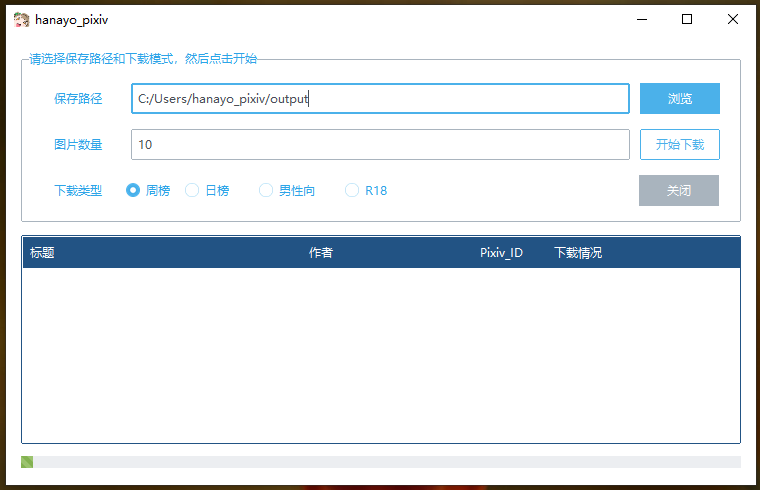

# hanayo_pixiv
hanayo的简单爬虫pixiv学习实践

### 实现了以下功能

- 可以选择下载周榜、日榜、男性向以及R18的排行榜图片
- 可以选择保存路径，默认放在当前文件夹的output下
- 对于多P的图片，会放在同一个文件夹
- 可以输入下载数量，默认是前10
- 可以显示下载进度
- 下载某画师所有作品（待开发


### 通过Cookie登录Pixiv

P站需要登录才能访问，以下步骤可以获取cookie

首先从chrome登录www.pixiv.net

登录成功后打开F12开发者模式

点击网络（network），然后过滤（filter）：www.pixiv.net。
（如果已登录的话，也可以筛选右上角的文档）

如下图所示：

<p align="center">
  
</p>

如果已登录的话，也可以筛选右上角的文档，这样更好找一点：
<p align="center">
  
</p>

### 如何使用
请获取cookie后，完整复制，然后放在同目录的my_cookie.txt中

然后运行主程序即可，所需库见requirements.txt

也可以选择下载release版

<p align="center">
  
</p>

## kayotin_house

### 背景介绍

最近房价好像跌了，广大人民（比如我）幻想着换一套好点的房子。于是用爬虫收集一下贝壳网上的二手房数据。懒得新开一个项目了所以放在这个pixiv的爬虫下面。

### 思路介绍

以上海为例，首先得到了如下链接

1. `https://sh.ke.com/ershoufang`
    
    简单分析下这个页面，我们知道房子信息是按照各个区区分的，如下图所示：
   <p align="center">
      
   </p>

2. 所以我们先获取每个城市的区划信息，这个信息也比较好获得。通过chrome的检查元素，可以很容易看出他`"class": "CLICKDATA"`
    
    ```python
    links_items = bs_html.find_all("a", {"class": "CLICKDATA",
                                              "data-action": "source_type=PC小区列表筛选条件点击"})
            for item in links_items:
                area = {
                    "name_cn": item.text,
                    "url": f"https://sh.ke.com/{item.get('href')}",
                }
    ```
    
    每个区，我们只获取他的名字和里面的链接，先存起来
    
3. 获得了区的链接和名字，链接大概这样`https://sh.ke.com/pudong`
    
    区里面是各个街道，我们下一步是获取街道信息，这里用如下信息来存储
    
    ```python
    "towns": [
                        # {
                        #     "name": "北蔡",
                        #     "url": "...",
                        #     "page_num": ""
                        # }
                    ]
    ```
    
    通过检查元素，通过如下元素可以获取到
    
    ```python
    divs = bs_html.find_all("div", {"data-role": "ershoufang"})
    items = divs[0].find_all("a", {"class": ""})
    ```
    
4. 最后，我们通过如下链接来得到具体房子数据`https://sh.ke.com/ershoufang/beicai/pg2/`
    
    可以看到最后有一个页码，我们需要通过页码来拼接链接，从而获取这个街道所有的房子，所以最后一步我们需要来获取每个街道的房子一共有多少页
    
5. 通过如下代码获取了页数
    
    ```python
    bs_html = ShellSpider.get_bs_html(url)
            pages = bs_html.find_all("div", {
                "class": "page-box house-lst-page-box",
                "comp-module": "page"
            })
            page_dict = json.loads(pages[0].get("page-data"))
            town["page_num"] = page_dict["totalPage"]
    ```
    
6. 有了页码，我们可以拼接出链接了，接下来就是通过request不断请求每一页，来获取房子数据了，我们小区名，房屋信息，总价，单价。
    
    ```python
    for info_div in info_divs:
                # 分别获取小区名，房屋信息，总价，单价
                community_name = fmt_info(info_div.find('div', class_='positionInfo').text)
                house_info = fmt_info(info_div.find('div', class_='houseInfo').text)
                total_price = fmt_info(info_div.find('div', class_='totalPrice totalPrice2').text)
                total_price = fmt_price(total_price)
                unit_price = fmt_info(info_div.find('div', class_='unitPrice').text)
                unit_price = fmt_price(unit_price)
    ```
    
7. 最终，我们用一个Pandas的DataFrame对象来存储所有房子信息，然后再存储在Excel文件或者Mysql数据库中

### 代码介绍

不如直接看注释，注释我尽可能写的详细了

[https://github.com/h-kayotin/hanayo_pixiv](https://github.com/h-kayotin/hanayo_pixiv/tree/master)

### 如何运行

克隆代码，并安装所有依赖库（见requirements.txt）后，直接运行*`kayotin_house.py`*

程序运行约需要15分钟，大约有9万条数据（2023年7月），请耐心等待。

### 其他参数

默认爬取上海的数据，如需其他城市，请先按如下添加其他城市代码

```python
city_names = {
        "sh": "上海",
        "gz": "广州"
    }
```

然后在main中做如下修改：

```python
my_spider = ShellSpider("shell", city="gz")
```

> 默认保存在Excel文件，需要要mysql，请设置mysql为true

数据库结构如下：

```python
CREATE table tb_sh
(
house_id int auto_increment COMMENT "编号",
area VARCHAR(255) not null comment "区",
street VARCHAR(255) not null comment "街道",
community VARCHAR(255) comment "小区",
info VARCHAR(1024) comment "房子信息",
total FLOAT comment "总价（万元）",
unit FLOAT comment "单价（元）",
date DATE comment "日期",
PRIMARY key (house_id)
)
```

运行如下代码保存到数据库：

```python
# 以下代码用于读取excel数据，存储到mysql
    # my_spider.house_info_df = pd.read_excel(io="datas/house/上海2023-07-17/房价数据.xlsx", index_col="id")
    # my_spider.save_to_mysql()
```
