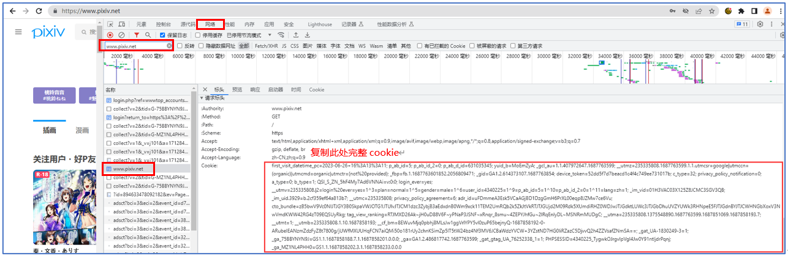

# hanayo_pixiv
hanayo的简单爬虫pixiv学习实践

### 实现了以下功能

- 可以选择下载周榜、日榜、男性向以及R18的排行榜图片
- 可以选择保存路径，默认放在当前文件夹的output下
- 对于多P的图片，会放在同一个文件夹
- 可以输入下载数量，默认是前10
- 可以显示下载进度
- 下载某画师所有作品（待开发

### 通过Cookie登录Pixiv

P站需要登录才能访问，以下步骤可以获取cookie

首先从chrome登录www.pixiv.net

登录成功后打开F12开发者模式

点击网络（network），然后过滤（filter）：www.pixiv.net

如下图所示：

  

### 如何使用
请获取cookie后，完整复制，然后放在同目录的my_cookie.txt中

然后运行主程序即可，所需库见requirements.txt

也可以选择下载release版

  

